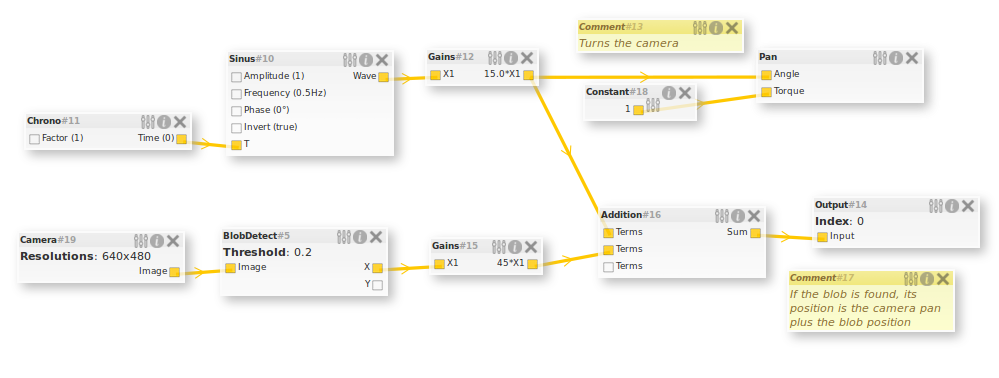

# blocks.js



## JavaScript dataflow graph editor

*blocks.js* is a JavaScript visual editor for editing dataflow graph, it can 
be used to edit processes graphs.

Note that this is just a flexible front-end editor, there is no back-end here.

You can [try a live demo](http://gregwar.com/blocks.js/).

## Overview

blocks.js is feeded using [blocks specifications](#blocks), using meta informations
explaining its fields, name and behaviour.

It allow the user to edit the blocks scene.

Then, thanks for instance to the `export()`, method, you can get back 
the edited [scene](#scene). When you load the blocks, you can also load back a scene.

## Using blocks.js

### Downloading

If you want to use it, you'll have to fetch the code, either by cloning this 
repository, or by 
[downloading it](https://github.com/Gregwar/blocks.js/archive/master.zip).

### Requirements

blocks.js uses:

* [jQuery](http://jquery.com/)
* [jquery-json](http://code.google.com/p/jquery-json/) for JSON export
* [jquery-mousewheel](http://plugins.jquery.com/mousewheel/) for scrolling zoom
* [jquery-svg](http://keith-wood.name/svg.html) for edges rendering
* [jquery-formserialize](http://malsup.com/jquery/form/) for forms serialization
  and deserialization
* [jquery-fancybox](http://fancyapps.com/fancybox/) for modal parameters edition

All these requirements are included in this repository. This is why the third party
libraries will look like this:

```html
<!-- Third party libraries -->
<script type="text/javascript" src="build/jquery.js"></script>
<script type="text/javascript" src="build/jquery.json.min.js"></script>
<script type="text/javascript" src="build/jquery.mousewheel.min.js"></script>
<script type="text/javascript" src="build/jquery.svg.min.js"></script>
<script type="text/javascript" src="build/jquery.formserialize.min.js"></script>
<script type="text/javascript" src="build/jquery.fancybox.min.js"></script> 
<link rel="stylesheet" type="text/css" href="build/fancybox/jquery.fancybox.css" />
```

Then, you'll have to load `blocks.js` and `blocks.css`:

```html
<!-- blocks.js -->
<script type="text/javascript" src="build/blocks.js"></script> 
<link rel="stylesheet" type="text/css" href="build/blocks.css" />
```

### Running it

Here is a simple example:

```js
// Instanciate Blocks
var blocks = new Blocks();

// Registering a simple block, with an input
// and an output
blocks.register({
    name: "Test",
    fields: [
        {
            name: "Input",
            attrs: "input"
        },
        {
            name: "Output",
            attrs: "output"
        }
    ]
});

// Running blocks on the div with the name "blocks"
blocks.run("#blocks");
```

Have a look at `simple.html`.

## Blocks

The blocks is an object containing:

* `name`: the name of the block
* `family`: the block family, this will be used to put it in the right
  blocks menu sub-section
* `module`: the block module, act like a namespace and avoid name collisions
* `description`: a description of what the block does, to help the user
* `size`: the size of the block, can be ̀`small`, `normal` or a certain
  number of pixels
* `class`: additionals CSS classes that will be added to the block
* `fields`: an array listing of the block [fields](#fields), see below

### Fields

A field can be an input, output and/or an editable parameter of the block.
It is an object containing:

* `name`: the name of the field, should not contain special chars
* `label`: the label of the field, which will be printed in
  the blocks title, can contain special characters
* `attrs`: a string containg field attributes, can contain `input`, `output`
  and/or `editable`. For instance: `"editable input"`
* `type`: the field type. See [typing](#typing).
* `defaultValue`: the default value of the field, that will be used if it's
  editable
* `hide`: do not display the editable field in the block information
* `hideLabel`: do not display the editable field label in the block information
* `card`: the cardinality of the input/output. This can be a string like `"0-3"`
  or and array like `[0,3]`, it represents the minimum and the maximum edges that
  can be connected to the I/O.
* `dimension`: the number of connection on the same field can depend on another
  field value, size, or be fixed to a static number. See [variadic I/Os](#variadoc-ios)

Do not hesitate to have a look at the repository demo, in the `demo/̀  directory.

## Scene

The scene is an easy-to-parse object containing:

* `blocks`: the [scene blocks](#scene-blocks)
* `edges`: the [scene edges](#scene-edges)

### Scene blocks

All scene block is represented with:

* `id`: its numeric ID
* `x` and `y`, the position of the block in the scene
* `type`: the block type name
* `module`: the block type module name
* `values`: an array containing the values of all its editable fields

### Scene edges

A scene edge is represented with:

* `id`: its numeric ID
* `block1`: the ID of the block where the edge starts
* `connector1`: the [connector](#scene-connectors) of the block where the edge starts
* `block2`: the ID of the block where the edge ends
* `connector2`: the [connector](#scene-connectors) of the block where the edge ends

### Scene connectors

A connector is an array containing 2 or 3 elements:

* A string, `input` or `output`, explaining if the connector is outgoing of
  the block or entering in it
* The name of the block field, in lower case
* Optionally, the index for [variadic fields](#variadic-ios)

## Typing

Each field can be typed. Basic types (`string`, `choice`, `longtext`, `bool`, `int`)
are rendered as form inputs, all other unknown types are rendered as a simple text
input. (Note: for `choice` type, you can define choices adding a ̀`choices` entry in
the block field).

If the type ends with `[]`, it is considered as an array, the Add & Remove buttons
will be added when editing.

By default, the different types are not compatibles, and thus can't be linked together.
You can however tell blocks.js that some types are compatible using:

```js
// Tells blocks.js that string and number are compatible and can be linked
blocks.types.addCompatibility('string', 'number');

// Tells blocks.js that an image can be converted to a string, however, the
// string can't be converted to an image
blocks.types.addCompatibilityOneWay('image', 'string');
```

## Variadic I/Os

Some I/Os can be variadic, think of a block that would output the n first users of
a database, you could define it this way:

```js
blocks.register({
    name: "TopUsers",
    description: "Outputs the n first users of the database",
    fields: [
        {
            name: "n",
            type: "int",
            hide: true,
            defaultValue: 3,
            attrs: "editable"
        },
        {
	    name: "users",
            label: "User #",
            dimension: "n",
            attrs: "output"
        }
    ]
});
```

Here, the number of outputed users will be editable, using the `n` editable
field. Note that the `#` will be replaced by the number of the output.

## Example

Here is an example that uses blocks.js:

* [ArduiFlow, arduino programming with blocks.js](https://github.com/Gregwar/ArduiFlow)

## Contributing & hacking

The development takes places in the `src/` directory. There is a `Makefile`
using `uglifyjs` command line to create the build.

You can use `index-dev.html` to test blocks.js using its sources, and `index.html`
to try it in build mode. 

The `build/` directory of this repository will not be updated on every commit, but
must contain a recent snapshot of the repository.

## License

blocks.js is under MIT license. Have a look at the LICENSE file for more information.
